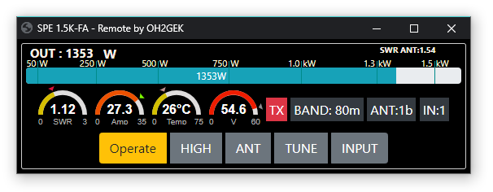

# SPE-1.3-2K-FA-Remote-server
Remote server for SPE Expert's 1.3K-2K-FA amplifiers.

I use SPE 1.3k and 1.5k amplifiers on my remote sites. Goal was to be able to use stations from my iPad/Iphone. Radio I have Flexradio and it works on iOS but there was no way to control my amplifiers. Whit this server you can contrl amplifiers from web or other devices that can do websocet. I also made ESP8266 based device tha has fysical led bar display for Forward power and SWR and Oled dipslay for oher informations and controll buttons for operate etc. 

This python program communicates with SPE Expert amplifiers via USB or RS-232 serial port and creates Websocket server to communicate with different clients.

I have been tested it with Web client and ESP8266 based device. By default server is listening port :8888 for clients. Project is built and tested with Raspberry Pi 2. Python version 2.7.13. Also you need python-serial and Tornado version 4.5.3. (sudo apt-get install python-serial and  sudo python -m pip install tornado==4.5.3)
For some reason I did't get it work with Tornado version 5.x 

I have also been running web server on same raspi (Lighttpd or apache) to run web client.
Copy content in WEB folder to your web server root folder and change in index.html code  ( ws = new WebSocket("ws://YOUR.SERVER.IP:8888/ws") to match your server IP/name setup.

I'm hobbyist and this project has been more like learning of python programming. My strategy has been Copy/Paste/Try/Fix. No garanti given. It works for me. Tested on 1.3 and 1.5 versions of SPE's. 

